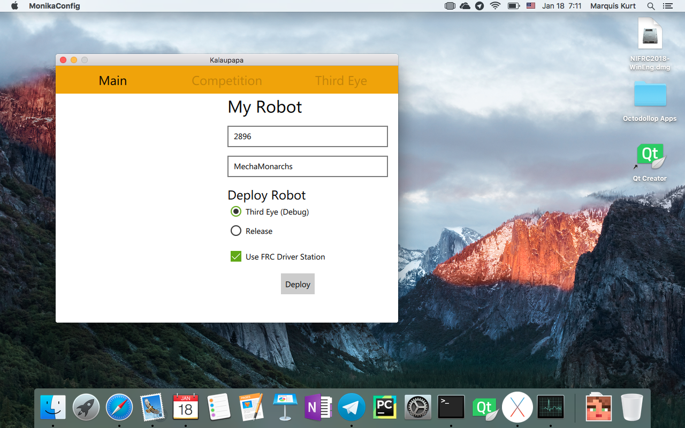

# Codename Kalaupapa
**An Akinom project**

## About Kalaupapa
Kalaupapa is a Python 3 app that works hand-in-hand with [Akinom](http://www.github.com/dmsmechamonarchs2896/robot-octodollop/), Team 2896's robot code. Kalaupapa aims to make configuring robots, deploying robots using RobotPy, and tracking matches and alliances easier on the Mac. 

> Codename Kalaupapa is named after the place in Moloka'i where Saint Damien served and assisted the lepers.

## Requirements (for building)
* MacOS 10.11 (El Capitan) or higher
* Python 3
* PyQt5 and Qt Creator (to build interfaces)
* Py2App

## Building
To build Kalaupapa, clone the repository and then run:
2. `python3 setup.py py2app`